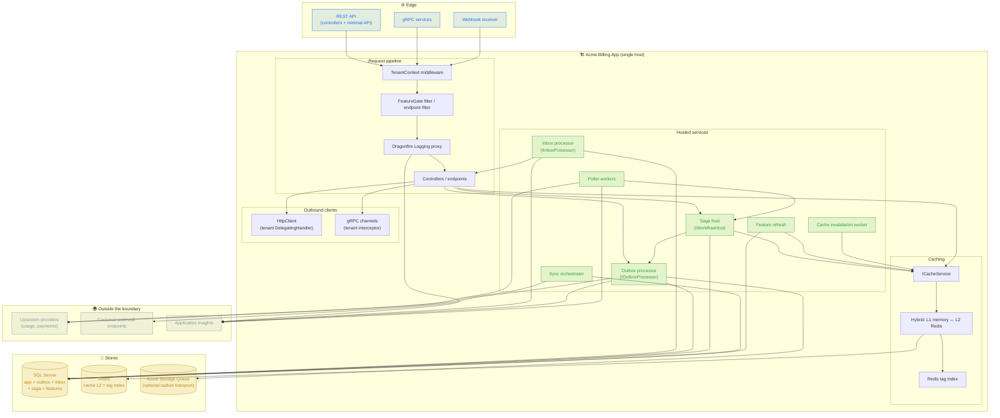
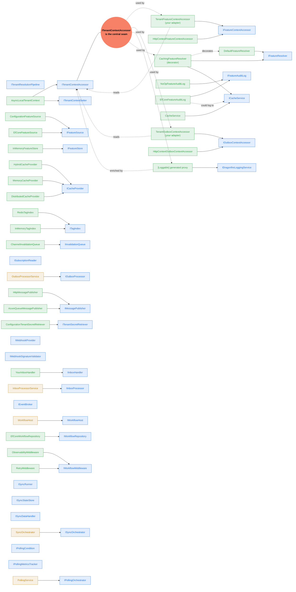
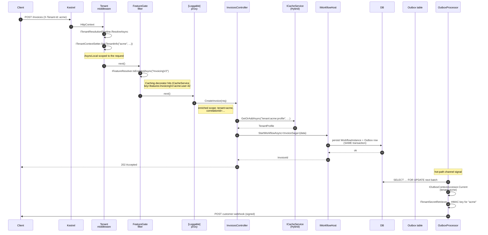
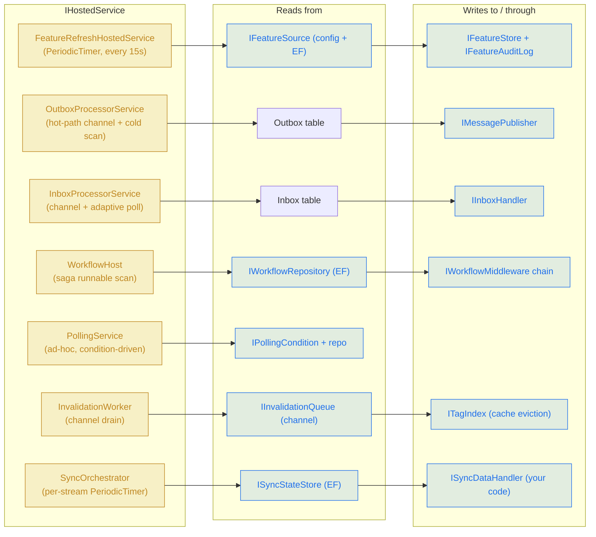
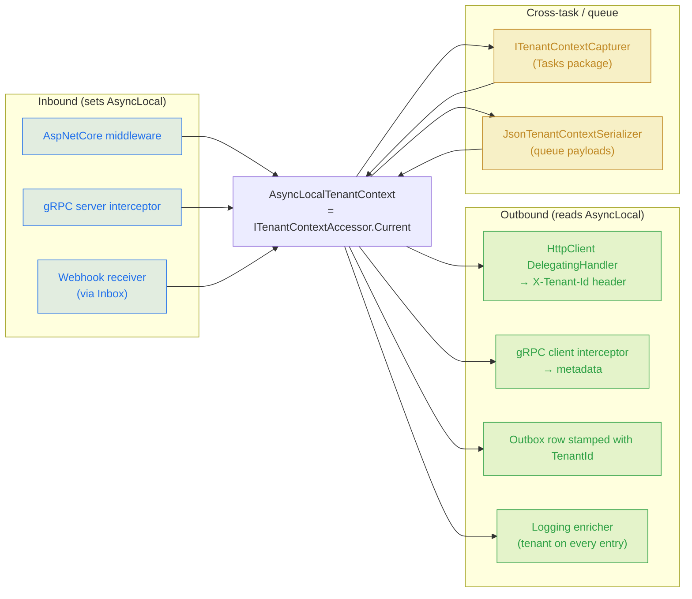
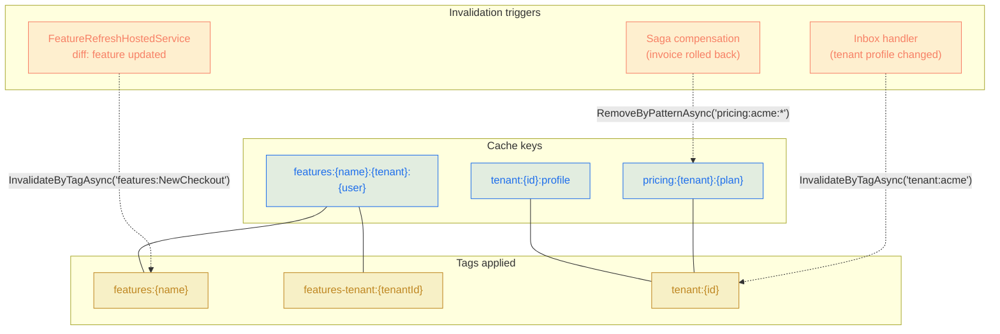
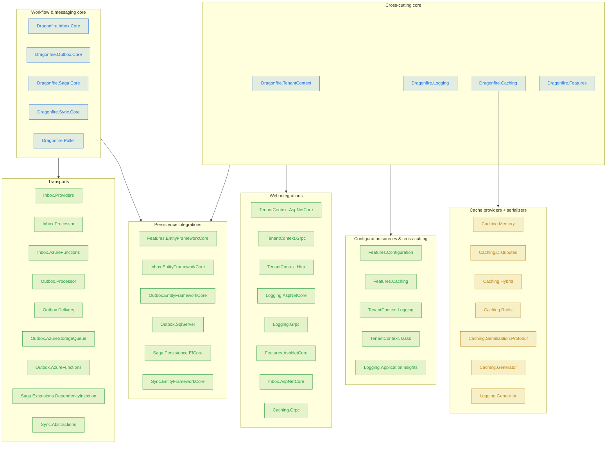

# Dragonfire — Reference Architecture

A worked example showing how every library in the Dragonfire suite slots into one
production application, where the interface seams are, and which library implements
which abstraction from which other library.

The diagrams use [Mermaid](https://mermaid.js.org); they render natively on GitHub
and in most modern IDEs.

> Scenario throughout this document: **Acme Billing**, a B2B2C SaaS that ingests
> usage events from upstream providers, stores them per tenant, runs a multi-step
> invoicing saga, fans out webhooks to customer-configured endpoints, and exposes
> a REST + gRPC surface to tenant operators. The codebase mounts every Dragonfire
> library and uses the interface seams to keep them decoupled.

---

## 1. System overview

A hand-rolled "what runs where" picture of the production application.



---

## 2. Interface composition graph

This is the heart of the diagram. Every Dragonfire library is built around one or
two **abstractions** that another library can **implement** to bind them together
in DI. Solid arrows point from `interface` → `implementation`. Dashed arrows mean
"is decorated by".



**The seams to remember:**

| Abstraction | Defined in | Implementations in this app |
|---|---|---|
| `ITenantContextAccessor` | `Dragonfire.TenantContext` | `AsyncLocalTenantContext` (default) |
| `IFeatureContextAccessor` | `Dragonfire.Features` | `HttpContextFeatureContextAccessor` (default) **OR** `TenantFeatureContextAccessor` (your adapter, reads `ITenantContextAccessor.Current`) |
| `IFeatureResolver` | `Dragonfire.Features` | `DefaultFeatureResolver` ⇽ decorated by `CachingFeatureResolver` (uses `ICacheService`) |
| `IFeatureSource` | `Dragonfire.Features` | `ConfigurationFeatureSource` + `EfCoreFeatureSource` (later wins on collision) |
| `IFeatureAuditLog` | `Dragonfire.Features` | `EfCoreFeatureAuditLog` |
| `IOutboxContextAccessor` | `Dragonfire.Outbox` | `HttpContextOutboxContextAccessor` **OR** `TenantOutboxContextAccessor` (reads `ITenantContextAccessor.Current`) |
| `IMessagePublisher` | `Dragonfire.Outbox` | `HttpMessagePublisher` (signs + posts) or `AzureQueueMessagePublisher` |
| `ICacheProvider` | `Dragonfire.Caching` | `HybridCacheProvider` ⇽ chains `MemoryCacheProvider` + `DistributedCacheProvider` |
| `ITagIndex` | `Dragonfire.Caching` | `RedisTagIndex` |
| `IWorkflowRepository` | `Dragonfire.Saga` | `EfCoreWorkflowRepository` |

The italicised "your adapter" rows are the integration glue you write in
`Acme.Billing.App` — typically 5–15 lines each. They are shown verbatim in §6.

---

## 3. Startup composition (`Program.cs`)

This is the order in which the libraries fall into place. The `using` blocks are
elided for brevity; every method is a real DI extension shipped by Dragonfire.

```csharp
var builder = WebApplication.CreateBuilder(args);

// ─── 1. Cross-cutting: tenant + logging come first so everything else
//                    can take a dependency on ITenantContextAccessor.
builder.Services
    .AddTenantContext()
        .AddHeaderResolver("X-Tenant-Id")
        .AddClaimResolver("tenant_id")
        .AddSubdomainResolver()
        .AddStaticFallback(TenantId.Empty);            // explicit "no tenant" fallback

builder.Services.AddDragonfireLogging(o =>
{
    o.RedactSensitiveData = true;
});
builder.Services.AddDragonfireTenantLogging();          // LoggingEnricher → ITenantContextAccessor

// ─── 2. Caching: hybrid memory + Redis, Redis-backed tag index.
builder.Services
    .AddDragonfireCaching()
    .AddHybridProvider(opt =>
    {
        opt.L1.Sizing = MemorySizing.Medium;
        opt.L2.ConnectionString = builder.Configuration["Redis"];
    })
    .AddRedisTagIndex(builder.Configuration["Redis"]!);
builder.Services.AddDragonfireGeneratedCaching();        // [Cache]/[CacheInvalidate] proxies

// ─── 3. Features: configuration + EF source, Caching decorator,
//                  AspNetCore filter, tenant-aware context accessor.
builder.Services.AddDragonfireFeatures(o => o.RefreshInterval = TimeSpan.FromSeconds(15));
builder.Services.AddDragonfireFeaturesConfiguration(builder.Configuration);
builder.Services.AddDragonfireFeaturesEntityFrameworkCore<AppDbContext>();
builder.Services.AddDragonfireFeaturesAspNetCore();
builder.Services.AddDragonfireFeaturesCaching(o => o.Ttl = TimeSpan.FromMinutes(1));

// Replace HttpContextFeatureContextAccessor with the tenant-aware adapter:
builder.Services.RemoveAll<IFeatureContextAccessor>();
builder.Services.AddSingleton<IFeatureContextAccessor, TenantFeatureContextAccessor>();

// ─── 4. Outbox: EF Core + SQL Server + HTTP delivery + tenant context.
builder.Services
    .AddOutboxNet()
    .UseEntityFrameworkCore<AppDbContext>()
    .UseSqlServerProcessor()
    .UseHttpMessagePublisher()
    .UseTenantSecretRetriever<DbTenantSecretRetriever>()
    .UseOutboxContextAccessor<TenantOutboxContextAccessor>();

// ─── 5. Inbox: EF Core + AspNetCore receiver + Stripe-style provider.
builder.Services
    .AddInboxNet()
    .UseEntityFrameworkCore<AppDbContext>()
    .AddProvider<StripeWebhookProvider>()
    .AddHandler<UsageEventHandler>()
    .ConfigureRetry(p => p.MaxAttempts = 8);

// ─── 6. Saga: EF Core persistence + retry + observability middleware.
builder.Services
    .AddSagaNet()
    .UseEntityFrameworkCorePersistence<AppDbContext>()
    .AddWorkflow<InvoiceSagaDefinition>()
    .AddMiddleware<ObservabilityMiddleware>()
    .AddMiddleware<RetryMiddleware>();

// ─── 7. Sync: per-stream pollers for upstream APIs.
builder.Services
    .AddSyncLibrary()
    .AddSyncStream<UsageProviderClient, UsageDto>(s => s.Interval = TimeSpan.FromMinutes(5));

// ─── 8. Poller: ad-hoc polling jobs (e.g. waiting on payments).
builder.Services
    .AddPolling<PaymentStatusRequest, PaymentStatusResponse>()
    .UsePersistence<EfCorePollingRepository>();

// ─── 9. AspNet pipeline.
builder.Services.AddControllers(o => o.Filters.AddService<FeatureGateActionFilter>());
builder.Services.AddGrpc(o => o.Interceptors.Add<TenantServerInterceptor>());

// ─── 10. Outbound HttpClient stamps tenant on every outgoing call.
builder.Services
    .AddHttpClient("upstream")
    .AddTenantPropagation();                            // DelegatingHandler from TenantContext.Http

var app = builder.Build();

app.UseTenantContext();                                  // sets AsyncLocal for the request
app.UseRouting();
app.MapControllers();
app.MapGet("/health", () => "ok").RequireFeature("HealthcheckV2");

app.Run();
```

---

## 4. Inbound request lifecycle

What happens when a customer hits `POST /tenants/acme/invoices` with
`X-Tenant-Id: acme`. The diagram only includes the libraries that participate.



**Where each library shows up in the trace:**

| Step | Library | Interface |
|---|---|---|
| 3–4 | `Dragonfire.TenantContext.AspNetCore` | `ITenantResolutionPipeline`, `ITenantContextSetter` |
| 5 | `Dragonfire.Features.AspNetCore` | `FeatureGateActionFilter` → `IFeatureResolver` |
| 6 | `Dragonfire.Features.Caching` | `CachingFeatureResolver` → `ICacheService` |
| 7 | `Dragonfire.Logging` | `[Loggable]`-generated proxy → `IDragonfireLoggingService` |
| 9 | `Dragonfire.Caching` | `ICacheService.GetOrAddAsync` |
| 10–11 | `Dragonfire.Saga` + `Dragonfire.Outbox` | `IWorkflowHost`, transactional outbox row |
| 13–17 | `Dragonfire.Outbox` | `OutboxProcessorService` reads, signs, delivers |

---

## 5. Background workers

Every Dragonfire library that needs to "tick" registers a hosted service. They
share `IServiceScopeFactory` for per-execution scopes and (where available) the
`ITenantContextAccessor` ambient when the work is per-tenant.



---

## 6. The integration adapters you write

These are the only "glue" classes you author. They are short — each one bridges
two abstractions that Dragonfire deliberately keeps independent.

### 6.1 `TenantFeatureContextAccessor` (TenantContext → Features)

```csharp
public sealed class TenantFeatureContextAccessor : IFeatureContextAccessor
{
    private readonly ITenantContextAccessor _tenant;
    private readonly IHttpContextAccessor   _http;

    public TenantFeatureContextAccessor(
        ITenantContextAccessor tenant,
        IHttpContextAccessor http)
    {
        _tenant = tenant;
        _http   = http;
    }

    public FeatureContext Current
    {
        get
        {
            var tenant = _tenant.Current;
            var userId = _http.HttpContext?.User
                .FindFirst(ClaimTypes.NameIdentifier)?.Value;

            return new FeatureContext(
                tenantId:   tenant.IsResolved ? tenant.TenantId.Value : null,
                userId:     userId,
                attributes: tenant.Properties);
        }
    }
}
```

### 6.2 `TenantOutboxContextAccessor` (TenantContext → Outbox)

```csharp
public sealed class TenantOutboxContextAccessor : IOutboxContextAccessor
{
    private readonly ITenantContextAccessor _tenant;
    public TenantOutboxContextAccessor(ITenantContextAccessor tenant) => _tenant = tenant;

    public OutboxContext Current
        => new(TenantId: _tenant.Current.TenantId.Value,
               UserId:   /* from claims if you need it */ null);
}
```

### 6.3 `DbTenantSecretRetriever` (your storage → Outbox HMAC keys)

```csharp
public sealed class DbTenantSecretRetriever : ITenantSecretRetriever
{
    private readonly IServiceScopeFactory _scope;
    public DbTenantSecretRetriever(IServiceScopeFactory scope) => _scope = scope;

    public async Task<string> GetWebhookSecretAsync(
        string tenantId, CancellationToken ct)
    {
        await using var s = _scope.CreateAsyncScope();
        var db = s.ServiceProvider.GetRequiredService<AppDbContext>();
        return await db.WebhookSecrets
            .Where(w => w.TenantId == tenantId)
            .Select(w => w.Secret)
            .SingleAsync(ct);
    }
}
```

That is the full set. Every other interface is implemented by a Dragonfire
library; the application only writes the three adapters above plus its own
business handlers (`UsageEventHandler`, `InvoiceSagaDefinition`, etc.).

---

## 7. Tenant propagation across boundaries

Multi-tenant applications drift fastest when tenant context is lost between
processes. `Dragonfire.TenantContext` ships an adapter for every outbound seam.



The `ITenantContextCapturer` is what you call before `Task.Run` /
`Channel.Writer.WriteAsync` so the worker re-establishes the same tenant. The
`JsonTenantContextSerializer` is for crossing process boundaries via queues —
e.g. enqueueing a job to Azure Storage Queue from the outbox.

---

## 8. Cache key + tag taxonomy

A consistent key + tag scheme is what makes invalidation across libraries safe.
Every Dragonfire-aware piece of code follows the same prefix discipline.



---

## 9. The 39 + 5 = 44 packages, mapped to layers

Where every package fits in the architecture. Everything below ships from this
mono-repo at a single `<Version>`.



---

## 10. Reading order for new contributors

1. **TenantContext** — every other library reads `ITenantContextAccessor`. Start
   here.
2. **Logging** — pairs with TenantContext via `TenantContext.Logging` enricher.
   Source-generated proxies are non-obvious; read `Generator` first.
3. **Caching** — `ICacheService` + provider stack. Hybrid is the default path in
   prod.
4. **Features** — built on Caching, Configuration, EF Core. Designed to be
   replaced bit by bit (custom `IFeatureSource`, custom `IFeatureContextAccessor`).
5. **Inbox + Outbox** — at-least-once delivery on top of EF Core transactions.
   The hot-path channel is the interesting bit.
6. **Saga** — uses Outbox transactionally for "publish on commit". Workflow
   middleware chain is the extension point.
7. **Sync** — periodic API pulls, separate from Poller (which is request/response).
8. **Poller** — orchestrates request/response polling with backoff. Use this for
   "wait until external job finishes".

---

*This document is the architecture entry point. For per-library deep-dives,
open the README.md inside each package's folder.*
